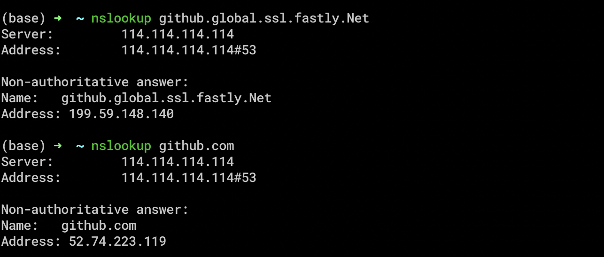

## About GitHub Pages

* [Tutorial](https://pages.github.com/) and [documentation](https://help.github.com/categories/github-pages-basics/) 

### [gh-pages 404](https://github.community/t5/GitHub-Pages/pages-user-site-not-published/td-p/2425)

```markdown
I got a 404 error when I navigated to <username>.github.io/<repo-name>

What worked for me was
-ensuring my repo was public
-changing the name of my repo to a new name (to repo-name2 for example) and then
-updating the package.json file with "homepage": "http://<username>.github.io/<repo-name2>"
-then running npm run deploy command again

this fixed the problem for me.
```

### 无法使用其他分支作为GitHub Pages source
[Solution](https://help.github.com/cn/enterprise/2.14/user/articles/configuring-a-publishing-source-for-github-pages): 启用 GitHub 页面以从 master 或 gh-pages 发布站点 (`分支命名固定`)

## About Git 
* [廖雪峰 Tutorial](https://www.liaoxuefeng.com/wiki/896043488029600)

### git clone 速度慢
1. 查找域名对应的ip地址



2. 修改hosts文件

```shell
$ sudo vi /etc/hosts
```
add the follow lines into 'hosts'
```vim
# github
199.59.148.140 github.global.ssl.fastly.Net
52.74.223.119  github.com
```

3. 刷新DNS缓存

```shell
$ sudo killall -HUP mDNSResponder
```

### [配置别名](https://www.liaoxuefeng.com/wiki/896043488029600/898732837407424)

```shell
$ git config --global alias.st status
$ git config --global alias.co checkout
$ git config --global alias.ci commit
$ git config --global alias.br branch
$ git config --global alias.unstage 'reset HEAD'
$ git config --global alias.last 'log -1'
...
```

### [git修改分支名称](https://www.jianshu.com/p/cc740394faf5)

远程分支重命名 (已经推送远程-假设本地分支和远程对应分支名称相同)

```shell
$ git branch -m <oldName> <newName>  # a. 重命名远程分支对应的本地分支
$ git push --delete origin <oldName>  # b. 删除远程分支
$ git push origin <newName> # c. 上传新命名的本地分支
$ git branch --set-upstream-to origin/<newName>  # d.把修改后的本地分支与远程分支关联
```

### Remove .DS_Store

```shell
$ echo .DS_Store >> .gitignore
```